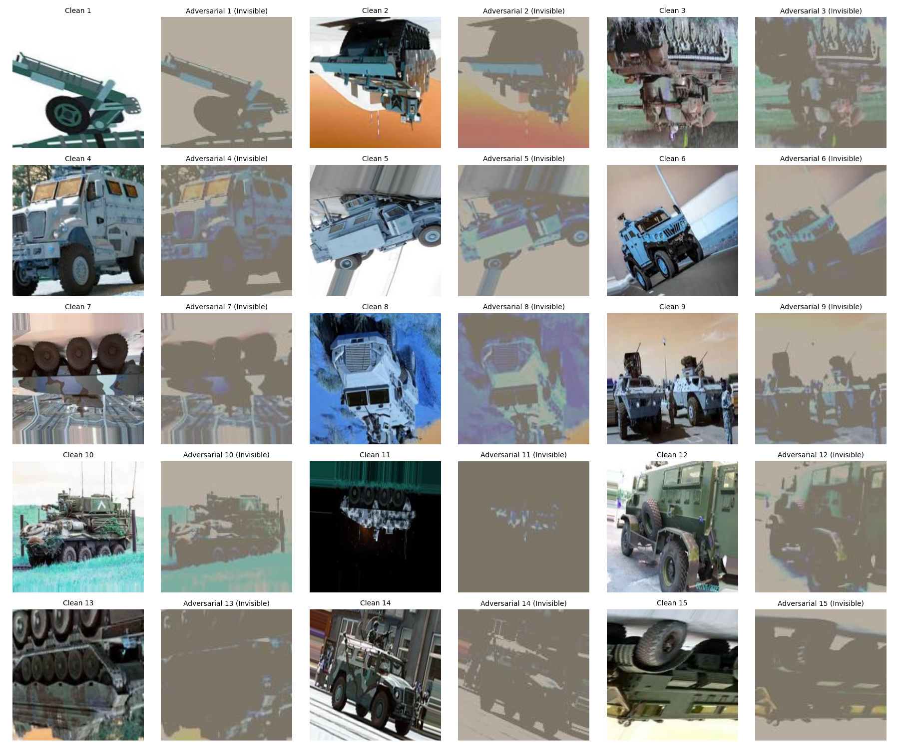

# 🔐 Adversarial AI Firewall for Drones
- This project aims to make AI systems used in drones **safe, reliable, and trustworthy**.
- Drone AI models are used to detect objects like vehicles or targets. However, these models can be **easily fooled by adversarial attacks**, which can lead to incorrect decisions.
- This project adds a **security layer** that detects such attacks and warns the user before any wrong decision is made.

## ⚙️ What Does the Project Do?

- Takes images from a drone camera or dataset  
- Uses an AI model to detect objects  
- Simultaneously checks if the image is **manipulated or suspicious**  
- If an attack is detected → shows **"ATTACK DETECTED"**  
- If no issue → shows **"CLEAR"**  

👉 Goal: Help humans make **safe and accurate decisions** using AI  
---

## 🧠 Primary Detection Model (Victim AI)

The **Primary Detection Model** is the main AI model used for:
- Detecting objects like tanks, vehicles, etc.
- Performing image classification

###  Model Used:
- **ResNet-50 (Pretrained CNN)**
- Fine-tuned for military vehicle detection

⚠️ Problem:  
This model can be **tricked by adversarial patches**, leading to incorrect predictions.

---

## 🛡️ Adversarial Detection Model (Firewall AI)

The **Adversarial Detection Model** acts as a security layer:
- Detects adversarial patches and suspicious patterns  
- Uses a **custom CNN + feature-based model**  
- Combines image features and statistical features for better detection  

It ensures that the system does not blindly trust the main AI model.

---

## ⚠️ What is an Adversarial Patch?

An **adversarial patch** is a small pattern or sticker added to an image to **fool an AI model**.

### Example:
- A tank with **white tape patches** may not be detected correctly  
- A vehicle with **red or yellow tape markings** may confuse the model  
- A tank with **camouflage patterns (woodland/desert)** may hide important features  
- A vehicle with **checkerboard patterns** can disrupt feature detection  
- A tank with **red-white stripe patches** may be misclassified  

👉 These patches:
- Exploit weaknesses in deep learning models  
- Cause wrong predictions  

---

## 🧠 Deep Learning Used in This Project

- **CNN (Convolutional Neural Network)** for image feature extraction  
- **ResNet-50** for object detection (Primary Model)  
- **Custom CNN Model** for adversarial detection  
- Image preprocessing using OpenCV (resize, normalize)  
- Feature extraction (edges, entropy, color stats)  
- Binary classification (Clean vs Adversarial)  

---

## 🎯 What the Project Tries to Achieve

- Detect adversarial attacks in real time  
- Prevent AI from making wrong decisions  
- Improve trust in AI-based drone systems  
- Support human decision-making with alerts and explanations  

---
## 🖼️ Clean vs Adversarial Image



### 🔍 Difference Between Clean and Adversarial Images

- **Clean Image:**
  - Normal image without any manipulation  
  - Easily recognized by both humans and AI models  
  - Contains natural features and patterns  

- **Adversarial Image:**
  - Contains specially designed perturbations or patches  
  - These changes are often **invisible or very hard for human eyes to notice**  
  - However, CNN models are highly sensitive to these small changes  
 Even though the image looks the same to humans, the **CNN model processes pixel-level details** and gets misled by these hidden patterns.

👉 This causes:
- Wrong classification  
- Misleading predictions  
- Reduced reliability of AI systems  

---

### 🧠 Key Insight

> Humans see the image globally, but CNN models analyze fine-grained pixel patterns.  
> Adversarial patches exploit this difference to fool the model without being noticed by humans.
## ▶️ How to Run the Project

### 🔹 Start Backend (FastAPI)

```bash
.\venv\Scripts\Activate.ps1
uvicorn backend.api:app --reload --port 8000
```
Backend runs at:

- http://localhost:8000
- http://localhost:8000/docs

### 🔹 Start Frontend (React)

Open a new terminal:
```bash
cd frontend
npm run dev
```

Frontend runs at:
http://localhost:5173

---
